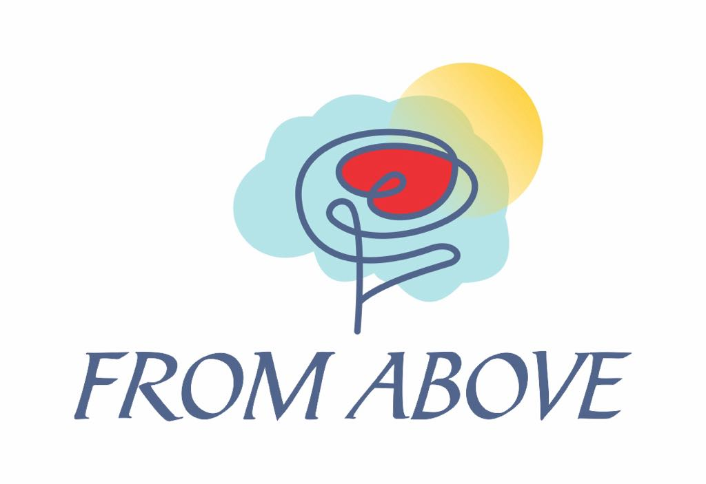

# fswa-fromabove

# **From Above - Helping Little Hearts Heal**



## **🌟 About the Project**
From Above is a web platform dedicated to providing **free psychological support for children and families** through the **FRITT SINN program**. The platform offers resources, counseling services, and a supportive community to help young hearts heal, one step at a time. 

## **🚀 Features**
- 🌍 **Multilingual Support (English & Norwegian)**
- 🎨 **Modern UI with Accessibility**
- 🔒 **User Authentication (Planned Feature)**
- 📖 **Educational Resources**
- ❤️ **Donation & Volunteer System (Future Expansion)**

## **🛠️ Tech Stack**
- **Framework:** Next.js 13+ (App Router)
- **Styling:** Tailwind CSS & shadcn/ui
- **State Management:** Zustand (Planned)
- **Localization:** JSON-based translations
- **Hosting:** Vercel (Recommended)

## **📂 Project Structure**
```
from-above/
├── app/
│   ├── [locale]/      # Dynamic routing for multi-language support
│   ├── globals.css    # Global styles
│   ├── layout.tsx     # Root layout
├── components/
│   ├── layout/
│   │   ├── navbar.tsx        # Main navigation bar
│   │   ├── language-switcher.tsx  # Language selection component
│   ├── ui/             # UI components (buttons, inputs, etc.)
├── lib/
│   └── translations/   # Translation JSON files
├── public/
│   └── from-above-logo.jpg  # Project logo
├── next.config.js      # Next.js configuration
├── package.json        # Dependencies & scripts
```

## **🛠️ Installation & Setup**
1️⃣ **Clone the Repository**
```sh
git clone https://github.com/yourusername/from-above.git
cd from-above
```

2️⃣ **Install Dependencies**
```sh
npm install
```

3️⃣ **Run the Development Server**
```sh
npm run dev
```
Your app should now be running at `http://localhost:3000` 🎉

## **🌍 Localization (i18n)**
Translations live in `lib/translations/`. To add a language, create a new JSON
file in that directory and update `next.config.js` with the locale code.

## **📦 Deployment**
This project is optimized for **Vercel** but can be deployed anywhere. To deploy on Vercel:
```sh
vercel
```
For static export:
```sh
npm run build && next export
```

## **📩 Contact**
For inquiries, reach out via email:
📧 **fromabove@protonmail.com**

---
💙 *Helping little hearts heal, one step at a time.*

